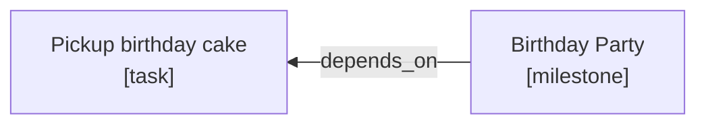
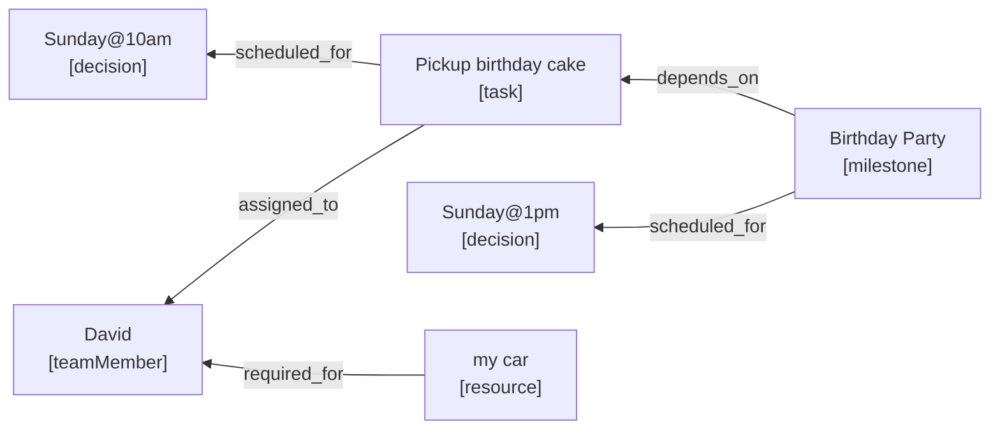

<!-- SPDX-License-Identifier: MIT -->
<!-- SPDX-FileCopyrightText: 2025 The DeadBranches contributors <https://github.com/DeadBranches> -->
# LM-Project-Management MCP Documentation Contents
<small><i>An MCP server for managing projects using knowledge graphs.</i></small>

## 1. Entities
<small>See: [Entities](docs/entities.md)</small>

> <big>Everything is a block.</big>

Everything is a block.

Blocks are the core unit of the project graph. 

> [!TIP]
> Here are some of the types of blocks you will work with. <small>(Don't worry, you don't have to remember this.)</small>
> 
> `task`, `resource`, `teamMember`, `milestone`, `priority`, `issue`

→ [Browse available block types](docs/entities.md)

## 2. Relationships
<small>See: [Relationships](docs/relationships.md)</small>

You can connect any two blocks together.

This connection is a **relationship**. 

In LM‑Project‑Management MCP, connections between blocks are called relationships. The simplest relationship is between a single block and another.

<small><i>Example 1: The Birthday Party depends on the task Pickup birthday cake. Block types are shown in [square brackets].</i></small>

Here, the relationship is `depends_on`.

It links the `task` block *"Pickup birthday cake"* to the `milestone` block *"Birthday Party."*

The relationship connects the `task` block *"picking up the birthday cake"* to the `milestone` *"Birthday Party"*.

Your project will probably have a few more connections.

<small><i>Example 2: One milestone. Many connections.</i></small>

Find out about the [Relationships](relationships.md) you'll work with.

## 3. Tools
<small>Link to [Tools](docs/tools.md) page.</small>

Your model receives tools from the mcp server. It uses those tools to interact with your data.

It's your job to learn what your model can do with those tools. We'll show you what to say to encourage the use of given tool.

Find out more about [Tools](tools.md).
